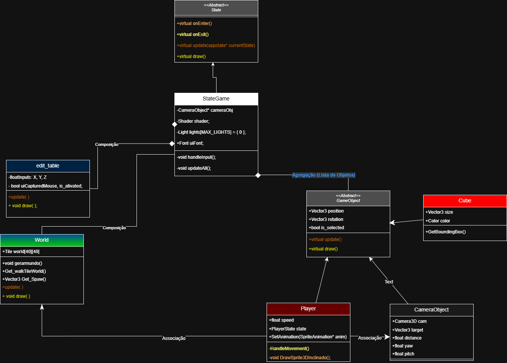
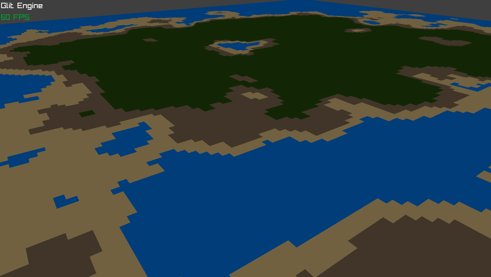

# Projeto de Jogo com Raylib
Este repositório contém um projeto de jogo simples desenvolvido usando a biblioteca Raylib em C++. O projeto é voltado ao teste de funcionalidades básicas de Raylib para a construção de jogos 2D e 3D.
O projeto é totalmente orientado a Obejtos.


# ⚙️ Diagramas
## diagrama de classe base



# 🏞️ Geração de terreno procedural com Perlin Noise
O mundo do jogo é gerado proceduralmente usando o algoritmo de Perlin Noise para criar terrenos.




# Como isntalar e rodar o projeto


<p >
🎥 <a href="https://www.youtube.com/watch?v=PaAcVk5jUd8">Video Tutorial on YouTube</a>
</p>


## 🐈‍⬛Comandos do repositorio
#### - dar comit
```
git add .
git commit -m "Janela"
git push -u origin main     
```


```
git remote add origin https://github.com/Glitcht0/raylib-project

git branch -M main         
git push -u origin main     
```


## 📕 A estudar 

- pesquisa por transformação de imagens e rotação por matrizes
- matrizes Ortonormais
- decomposição de valores singulares


## 🔨 Funções Basicas


📐 Primitivas 2D (formas básicas)
Retângulos
```
DrawRectangle(int x, int y, int width, int height, Color color);
DrawRectangleV(Vector2 pos, Vector2 size, Color color);
DrawRectangleRec(Rectangle rec, Color color);
DrawRectangleLines(int x, int y, int width, int height, Color color);
DrawRectangleLinesEx(Rectangle rec, float lineThick, Color color);
DrawRectangleRounded(Rectangle rec, float roundness, int segments, Color color);
DrawRectangleRoundedLines(Rectangle rec, float roundness, int segments, float lineThick, Color color);
```

Círculos
```
DrawCircle(int centerX, int centerY, float radius, Color color);
DrawCircleV(Vector2 center, float radius, Color color);
DrawCircleLines(int centerX, int centerY, float radius, Color color);
DrawCircleSector(Vector2 center, float radius, float startAngle, float endAngle, int segments, Color color);
DrawCircleGradient(int centerX, int centerY, float radius, Color color1, Color color2);
```

Linhas
```
DrawLine(int startX, int startY, int endX, int endY, Color color);
DrawLineV(Vector2 start, Vector2 end, Color color);
DrawLineEx(Vector2 start, Vector2 end, float thick, Color color);
DrawLineBezier(Vector2 start, Vector2 end, float thick, Color color);
```

Triângulos / Polígonos
```
DrawTriangle(Vector2 v1, Vector2 v2, Vector2 v3, Color color);
DrawTriangleLines(Vector2 v1, Vector2 v2, Vector2 v3, Color color);
DrawPoly(Vector2 center, int sides, float radius, float rotation, Color color);
DrawPolyLines(Vector2 center, int sides, float radius, float rotation, Color color);
DrawPolyLinesEx(Vector2 center, int sides, float radius, float rotation, float lineThick, Color color);
```

🖼️ Texturas e imagens (sprites)
```
DrawTexture(Texture2D texture, int x, int y, Color tint);
DrawTextureV(Texture2D texture, Vector2 position, Color tint);
DrawTextureEx(Texture2D texture, Vector2 position, float rotation, float scale, Color tint);
DrawTextureRec(Texture2D texture, Rectangle source, Vector2 position, Color tint);
DrawTexturePro(Texture2D texture, Rectangle source, Rectangle dest, Vector2 origin, float rotation, Color tint);
```


👉 DrawTexturePro é o mais poderoso (rota, escala, origem customizada).

🔤 Texto / Fontes
```
DrawText(const char *text, int x, int y, int fontSize, Color color);
DrawTextEx(Font font, const char *text, Vector2 position, float fontSize, float spacing, Color tint);
DrawTextPro(Font font, const char *text, Vector2 position, Vector2 origin, float rotation, float fontSize, float spacing, Color tint);
DrawFPS(int posX, int posY);
```

📦 Helpers de 2D
Grade
```
DrawGrid(int slices, float spacing);
```

Fundo
```
ClearBackground(Color color);
```

🧠 Importante (pipeline 2D)

Tudo isso funciona entre:
```
BeginDrawing();
ClearBackground(RAYWHITE);

// DESENHO 2D AQUI

EndDrawing();
```


Se você estiver em 3D:

```
BeginDrawing();
ClearBackground(RAYWHITE);

BeginMode3D(camera);
// desenho 3D
EndMode3D();

// desenho 2D por cima (HUD, UI)
DrawText("UI", 10, 10, 20, WHITE);

EndDrawing();
```


