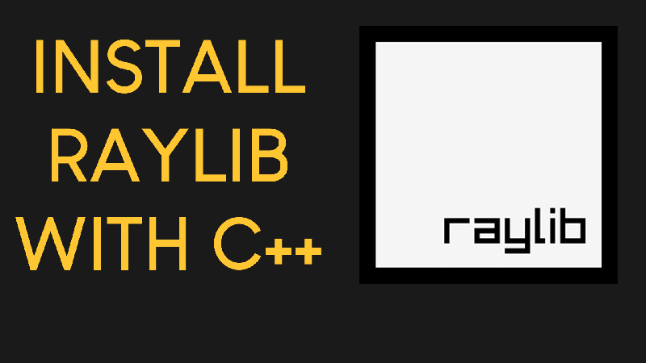

# Raylib-CPP-Starter-Template-for-VSCODE-V2
Raylib C++ Starter Template for Visual Studio Code on Windows.
This demo project contains a bouncing ball raylib example program.
It works with raylib version 5.0. Tested on both Windows 10 and Windows 11.

# How to use this template
1. Double click on the main.code-workspace file. This will open the template in VS Code.
2. From the Explorer Window of VS Code navigate to the src folder and double click on the main.cpp file.
3. Press F5 on the keyboard to compile and run the program.

# What's changed
The template now uses folders for better organizion of the files. So, all the source code now lives in the src folder.

# Video Tutorial

  

🎥 <a href="https://www.youtube.com/watch?v=PaAcVk5jUd8">Video Tutorial on YouTube</a>

 
 

| 📺 <a href="https://www.youtube.com/channel/UC3ivOTE5EgpmF2DHLBmWIWg">My YouTube Channel</a>
| 🌍 <a href="http://www.programmingwithnick.com">My Website</a> |  

git add .
git commit -m "Meu Segundo commit"

git remote add origin https://github.com/Glitcht0/raylib-project

git branch -M main         
git push -u origin main     

#include <raylib.h>
#include "ball.h"

int main() 
{
    const Color darkGreen = {20, 160, 133, 255};
    
    constexpr int screenWidth = 800;
    constexpr int screenHeight = 600;
    
    Ball ball;
    
    InitWindow(screenWidth, screenHeight, "My first RAYLIB program!");
    SetTargetFPS(60);
    
    while (!WindowShouldClose())
    {
        ball.Update();
        
        BeginDrawing();
            ClearBackground(darkGreen);
            ball.Draw();
        EndDrawing();
    }
    
    CloseWindow();
}

#include <raylib.h>

int main() {
    int ballx = 400;
    int bally = 400;
    Color cor = {30, 42, 50, 255};
    
    SetConfigFlags(FLAG_MSAA_4X_HINT);
    InitWindow(800, 800, "My fist raylib game");
    SetTargetFPS(60);

    //Game Loop
    while(WindowShouldClose() == false) {

        // 1. Event handling

        // 2. updating Positions

        if(IsKeyDown(KEY_RIGHT)){
            ballx += 3;
        } else if(IsKeyDown(KEY_LEFT)){
            ballx -=3;
        } else if(IsKeyDown(KEY_UP)){
            bally -= 3;
        }else if(IsKeyDown(KEY_DOWN)){
            bally += 3;
        }

        // 3. Drawing
        BeginDrawing();
        ClearBackground(cor);
        
        DrawCircle(ballx, bally, 20, WHITE);
        EndDrawing();

        
    }

    CloseWindow();
    return 0;

}

#include "raylib.h"

int main(void)
{
    // Janela
    SetConfigFlags(FLAG_MSAA_4X_HINT);
    SetConfigFlags(FLAG_VSYNC_HINT);

    InitWindow(800, 600, "Raylib 3D - Exemplo simples");
    SetTargetFPS(60);

    // Camera 3D
    Camera3D camera = { 0 };
    camera.position = (Vector3){ 4.0f, 4.0f, 4.0f };
    camera.target   = (Vector3){ 0.0f, 1.0f, 0.0f };
    camera.up       = (Vector3){ 0.0f, 1.0f, 0.0f };
    camera.fovy     = 45.0f;
    camera.projection = CAMERA_PERSPECTIVE;

    // Loop principal
    while (!WindowShouldClose())
    {
        // Atualiza câmera (mouse gira)
        UpdateCamera(&camera, CAMERA_ORBITAL);

        BeginDrawing();
        ClearBackground(RAYWHITE);

        BeginMode3D(camera);

            // Chão
            DrawPlane(
                (Vector3){ 0.0f, 0.0f, 0.0f },
                (Vector2){ 10.0f, 10.0f },
                LIGHTGRAY
            );

            // Cubo
            DrawCube(
                (Vector3){ 0.0f, 1.0f, 0.0f },
                1.0f, 1.0f, 1.0f,
                RED
            );

            // Contorno do cubo
            DrawCubeWires(
                (Vector3){ 0.0f, 1.0f, 0.0f },
                1.0f, 1.0f, 1.0f,
                BLACK
            );

        EndMode3D();

        DrawText("Cubo 3D simples", 10, 10, 20, DARKGRAY);
        DrawFPS(10, 40);

        EndDrawing();
    }

    CloseWindow();
    return 0;
}
